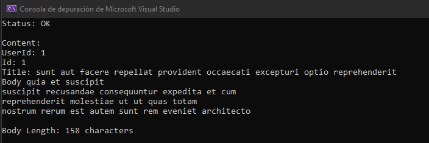

# Test 1
### Tarea:
Crear una aplicación que dada un url cualquiera, pueda recuperar el contenido y estatus. Luego informar la cantidad de caracteres del body.

### Resolucion:
El metodo `processUrl()` recibe una URL y un id, luego muestra en consola la informacion requerida.  
**Aclaracion:** Para este ejemplo se uso como url http://jsonplaceholder.typicode.com/posts  
  

